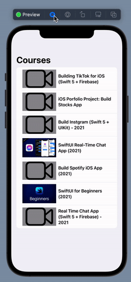

# SwiftUIApiCalls
A basic swiftUI Api Call practice app

## Summary
A simple API fetching app for API practice in SwiftUI

## Built With
* [SwiftUI](https://developer.apple.com/tutorials/swiftui)
* [UIKit](https://developer.apple.com/documentation/uikit)

## Gif of App

## Installation Steps For Local Running
1. Clone project.
2. Open terminal
3. cd 'your-desired-path'
4. git clone 'paste-link-here'
5. open project in Xcode and run

## Author

* **Mehdi Safari**

- [Link to Github](https://github.com/mehdisafari77)
- [Link to LinkedIn](https://www.linkedin.com/in/mehdi-safari-992799142/)
